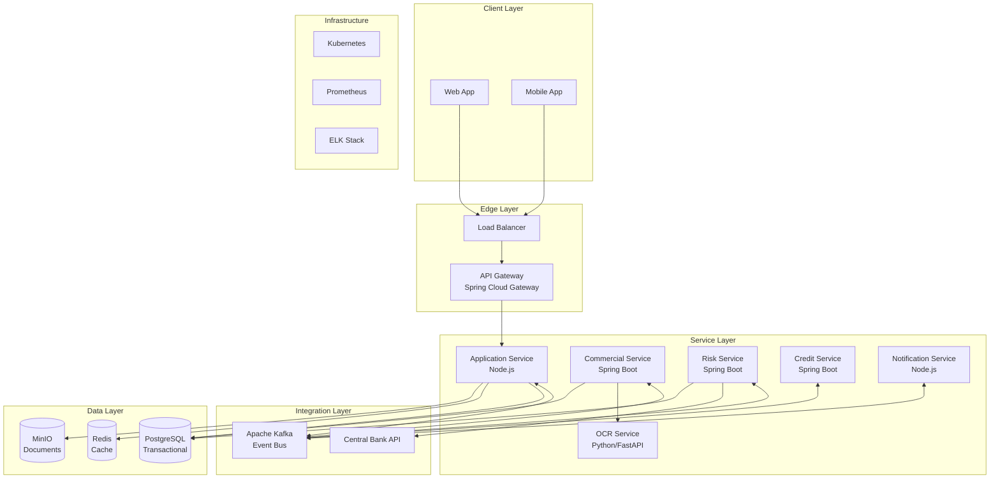

# Reactive Loan Application System

This project implements a reactive microservices-based loan application submission system.

## Architecture

- **API Gateway**: Spring Cloud Gateway
- **Application Service**: Node.js with Express
- **Message Broker**: Apache Kafka
- **Storage**: PostgreSQL, MinIO, Redis
- **Containerization**: Docker

## How to run

1. Make sure you have Docker and Docker Compose installed.
2. Clone this repository.
3. Run `docker-compose up --build` from the root directory.

The API Gateway will be available at `http://localhost:8080`.
